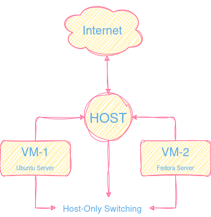

# Linux Virtualization & Networking lab

Goals:
- Build multi-VM linux lab using Oracle VirtualBox.
- Use a dual-network architecture (NAT + Host-only).
- Configure an isolated internal VM network.
- Observe difference between Redhat and Debian in setting up.

### Create Virtual Machines:
<video src="scr/configure-iso.webm" controls></video>
- 1- Start VirtualBox and click on "New".
- 2- Choose a name and a folder for VM assets.
- 3- Select ISO file and click on next.
- 4- Modify base memory and processors or go by default.
(increased the cpu to 2 for package management)
- 5- Create at least 15GB of virtual disk.
- 6- Click on finish and do the same for ubuntu server.

### Fedora 42 installation:
<video src="scr/fedora-42-installation.webm" controls></video>
- 1- Click on next until installation summary page.
- 2- Go on installation destination, choose the created virtual disk.
- 3- Enable root account for root previlages or create a new user.
- 4- Finally begin the installation.
